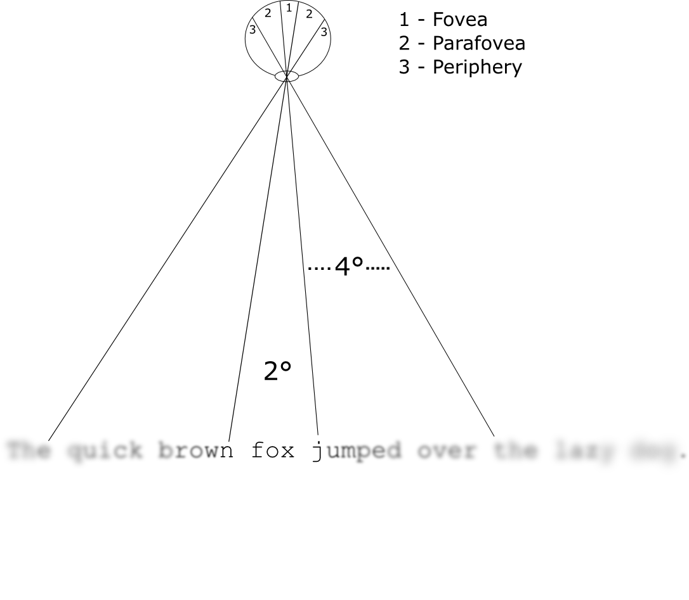

<style type="text/css">
pre {
  font-size: 25px
}
</style>


# Eye movements in reading


## High visual acuity is restricted to a small region



<div class="notes">
We move our eyes while we read because vision is clearest in a small region of the retina called the *fovea* (and blurs progressively beyond). We reposition the fovea to gather information from new regions (i.e., unread words). We also gather some information from the parafovea and periphery as well.

</div>


## Eye fixations

- Periods when our eyes are relatively stable
- Perform perceptual and cognitive processing (i.e., identifying words)
- Plan subsequent *saccade* (eye movement)
- All within 200-250 ms


## Eye movements in reading

- Readers of English move their eyes forward 7-8 characters at a time
- Eye fixation durations are influenced by ongoing processing (i.e., difficulty of word identification or comprehension due to perceptual or cognitive factors)
- Readers occasionally skip over words (i.e., they are not directly fixated), and *regress* to reread previous material

## Word skipping

Interestingly, we skip words about 25-30% of the time!^[<a name="ft1" href="#ftn.ft1">1</a>]^

We tend to skip over words that are:

1. Short (2-4 letters)^[<a name="ft2" href="#ftn.ft2">2</a>]^
2. Frequent in the language (like *the*)^[<a name="ft3" href="#ftn.ft3">3</a>]^
3. Predictable from the prior context^[<a name="ft4" href="#ftn.ft4">4</a>]^

<div class="footnote"><p>
^[<a name="ftn.ft1" href="#ftn.ft1">1</a>]^
Rayner (1998, 2009) ^[<a name="ftn.ft2" href="#ftn.ft2">2</a>]^
Rayner & McConkie (1976) ^[<a name="ftn.ft3" href="#ftn.ft3">3</a>]^
O'Regan (1979) ^[<a name="ftn.ft4" href="#ftn.ft3">4</a>]^
Balota, Pollatsek, & Rayner (1985)
</div>


## Why do we skip?

The E-Z Reader model^[<a name="ft5" href="#ftn.ft5">5</a>]^ (also SWIFT)^[<a name="ft6" href="#ftn.ft6">6</a>]^ assumes that words are skipped because they are processed to an extent from the parafovea

Effects of word length, frequency, and predictability on skipping may indicate more rapid parafoveal processing when words are easier vs. more difficult to identify

The extent of parafoveal processing is often tested using the  boundary paradigm^[<a name="ftn.ft7" href="#ftn.ft7">7</a>]^

<div class="footnote"><p>
^[<a name="ftn.ft5" href="#ftn.ft5">5</a>]^ Reichle, Pollatsek, Fisher, & Rayner (1998) ^[<a name="ftn.ft6" href="#ftn.ft6">6</a>]^ Engbert, Nuthmann, Richter, & Kliegl (2005) ^[<a name="ftn.ft7" href="#ftn.ft7">7</a>]^ Rayner (1975)
</div>


## Gaze-contingent boundary paradigm

An invisible boundary is programmed into the script in the space preceding a target word, enabling control over parafoveal preview (e.g., of Xs). Once the eyes cross the boundary, the preview is replaced with the correct word. 

<div class="centered" style="margin-top:80px;">
```
Readers will sometimes XXXX over words.
```
</div>


## Gaze-contingent boundary paradigm

An invisible boundary is programmed into the script in the space preceding a target word, enabling control over parafoveal preview (e.g., of Xs). Once the eyes cross the boundary, the preview is replaced with the correct word. 

<div class="centered" style="margin-top:80px;">
```
Readers will sometimes skip over words.
```
</div>


## Evidence for parafoveal processing prior to skipping

- Readers skip parafoveal previews of non-words less often than previews of real words (i.e., *livor* for *liver*)^[<a name="ft8" href="#ftn.ft8">8</a>]^

- Readers skip high-frequency (HF) words more often than length-matched low-frequency (LF) words^[<a name="ft9" href="#ftn.ft9">9</a>]^

- Readers skip predictable words more often than unpredictable words (even really long ones)^[<a name="ft10" href="#ftn.ft10">10</a>]^

<div class="footnote"><p>
^[<a name="ftn.ft8" href="#ftn.ft8">8</a>]^ Drieghe, Rayner, & Pollatsek (2005) ^[<a name="ftn.ft9" href="#ftn.ft9">9</a>]^ Inhoff & Rayner (1986) ^[<a name="ftn.ft10" href="#ftn.ft10">10</a>]^ Rayner, Slattery, Drieghe, & Liversedge (2011)
</div>


## The influence of context

The predictability effect on skipping would indicate the role of the sentence or discourse context but...

Angele and Rayner (2013) found that readers skipped previews of *the* more often than other 3-letter words even when contextually inappropriate (syntactically)

<div class="centered" style="margin-top:10px;">
```
She was sure she would the all of the tests.
```
</div>


## The influence of context

The predictability effect on skipping would indicate the role of the sentence or discourse context but...

Angele and Rayner (2013) found that readers skipped previews of *the* more often than other 3-letter words even when contextually inappropriate (syntactically)

<div class="centered" style="margin-top:10px;">
```
She was sure she would ace all of the tests.
```
</div>

>- Is this because *the* is processed automatically, or because readers do not fully use the context when deciding to skip (or fixate)?


## E-Z Reader 10: A testable framework {.build}

E-Z Reader 10^[<a name="ft8" href="#ftn.ft8">8</a>]^ is a computational model of eye movements in reading which posits that readers process one word at a time (with serial shifts of covert attention between them)

Attention and eye movement programming are "decoupled" to an extent

Words are skipped when an early stage of word identification ($L_1$--the "familiarity check") completes from the parafovea before the eyes are ready to move on (by default) to the next word

The time to complete $L_1$ is dependent on word frequency, predictability, and eccentricity from the point of fixation

<div class="footnote"><p>
^[<a name="ftn.ft11" href="#ftn.ft11">11</a>]^ Reichle, Warren, & McConnell (2009)
</div>


## A testable framework {.flexbox .vcenter}

<div class="centered" style="margin-top:10px;">
```
She was sure she would ace all of the tests.
```
</div>


## A testable framework

In E-Z Reader 10, postlexical integration (i.e., of syntax and semantics) is a separate stage that follows lexical access ($L_1$ & $L_2$)

If the integration process lags far behind identification of the next word, it breaks down and causes the forward-moving engine to halt (and either stay in place longer or regress)

Difficulty with word identification (i.e., LF words) versus integration (i.e., syntactic ambiguity) should have different signatures across the eye movement record^[<a name="ft12" href="#ftn.ft12">12</a>]^

<div class="footnote"><p>
^[<a name="ftn.ft12" href="#ftn.ft12">12</a>]^ Staub (2011)
</div>


## Testing E-Z Reader's assumptions

1. If skipping is based on a rapid check of a word's identity,  variables like frequency and predictability should influence skipping while difficulty of integration should not (Chapters 2 & 3)

2. Given (1), the likelihood of skipping a word should be primarily based on the ease of identification, and not oculomotor or contextual constraints (Chapter 3)

3. If identification and integration are sequential processes, then when identification and integration difficulty affect the same eye movement measure (i.e., *first fixation duration*), their effects should be strictly additive, not interactive. And, integration but not identification difficulty may increase the likelihood of regressing (Chapter 4)


# Skipping syntactically illegal "the"-previews: The role of predictability (Chapter 2) | Abbott, Angele, Ahn, & Rayner (2015; *JEP:LMC*)


## Skipping "the"

Angele and Rayner (2013) showed that readers prefer to skip instances of *the*, even when infelicitous in context

How can we reconcile this with the well-known effect that predictability has on skipping? 

We manipulated predictability along with parafoveal preview (invalid instances of *the*) to test this question


## Experiment 2.1: Method 

* *N* = 48, 40 sentences with a 2 predictability (high or low constraint target word) X 2 parafoveal preview (correct preview or invalid preview of *the*) design
* Predictability measured using cloze task (on Amazon MTurk)
* Target words (verbs) guessed 77% of the time in the
predictable condition, 5% of the time in the unpredictable condition
* SR Research EyeLink 1000 eyetracker
* Boundary paradigm (0--7 ms display change latency)


## Experiment 2.1: Predictable sentence

<div style="margin-top:200px; margin-left: 70px">
```
If you are happy with your waiter you should
```
</div>


## Experiment 2.1: Predictable sentence

<div style="margin-top:200px; margin-left: 70px">
```
If you are happy with your waiter you should tip twenty percent.
```
</div>


## Experiment 2.1: Unpredictable sentence

<div style="margin-top:200px; margin-left: 70px">
```
If you are happy with your experience you should
```
</div>


## Experiment 2.1: Unpredictable sentence

<div style="margin-top:200px; margin-left: 70px">
```
If you are happy with your experience you should tip twenty percent.
```
</div>


## Experiment 2.1: Preview

<div style="margin-top:200px; margin-left: 70px">
```
If you are happy with your waiter you should the twenty percent.
```
</div>


## Experiment 2.1: Preview

<div style="margin-top:200px; margin-left: 70px">
```
If you are happy with your waiter you should tip twenty percent.
```
</div>


## Experiment 2.1: Hypotheses

1. If readers use all available contextual information to guide eye movements, then invalid *the* previews should be skipped less often when the target word is predictable vs. unpredictable (i.e., an interaction of some form)

2. If skipping involves a rough check of a word's identity (and no deeper processing), then invalid instances of *the* should be skipped more often than the target words, and may be affected by target word constraint (i.e., additive factors)


## Experiment 2.1: the-skipping {.flexbox .vcenter}


<figcaption>Figure 2.2</figcaption>


## Experiment 2.1: Post-target disruption {.flexbox .vcenter}


<figcaption>Figure 2.3</figcaption>


## How do these results fit with E-Z Reader?

* Both the frequency of the preview (*the* is highly frequent) and target word predictability affected skipping

* Contextual fit did not affect skipping, but affected downstream processing

* Can E-Z Reader accomodate these results due to the very high frequency of *the* alone, or is *the*-skipping also driven by the relative predictability of the (absent) target word?


## Experiment 2.1: the-skipping simulated {.flexbox .vcenter}


<figcaption>Figure 2.6</figcaption>


## Chapter 2 summary

* Readers skip *the* at a very high rate without regard to its contextual fit

* The effects of frequency and predictability on skipping appear to be additive (even when the parafoveal word is not the predicted word)

* E-Z Reader can simulate this pattern

* Could this behavior be limited to very short words like *the*?


# Preferential skipping of function words during reading (Chapter 3) | Abbott and Angele (in prep)


## Constraints on skipping

In Chapter 2 I demonstrated that skipping is driven by a rough check of a word's identity, without regard to contextual fit

This highlights the role of parafoveal processing in skipping, but also reveals its limits

Are the effects from Chapter 2 limited to very short, very high frequency words like *the*?


## Constraints on skipping

Skipping short words may be somewhat unique due to oculomotor constraints (i.e., saccadic range error^[<a name="ft13" href="#ftn.ft13">13</a>]^) 

Short words like *the* may be skipped accidentally more often than longer words (and so may display a smaller frequency effect)

If the behavior from Chapter 2 (and skipping in general) reflects parafoveal processing, then the "*the*-skipping effect" (skipping without regard to context) should hold for longer (4 or 5-letter) words

We jointly manipulated word length and parafoveal preview to examine this issue

<div class="footnote"><p>
^[<a name="ftn.ft13" href="#ftn.ft13">13</a>]^ McConkie, Kerr, Redix, & Zola (1988)
</div>


## Chapter 3 Method

**Experiment 3.1**

- 48 undergrads read 180 sentences (60 from Angele et al., 2014)
- 3 length (3, 4, or 5 letters) X 2 parafoveal preview (valid preview of a verb or invalid preview of a HF noun) design
- Sentences written to be low predictability (*M* = .06)

**Experiment 3.2**

- Same design as Experiment 3.1 (& same *N*)
- *the*, *that*, *there* used as invalid previews


## Experiment 3.1: Invalid previews

<div style="margin-top:0px; margin-left: 70px">
```
He found the shoes a tiny buy too small.

If you very quickly feet in circles you are likely to become dizzy.

The toddler could not quite games the jar of cookies on top of the counter.
```
</div>


## Experiment 3.1: Post boundary change (correct targets)

<div style="margin-top:0px; margin-left: 70px">
```
He found the shoes a tiny bit too small.

If you very quickly spin in circles you are likely to become dizzy.

The toddler could not quite reach the jar of cookies on top of the counter.
```
</div>


## Experiment 3.1: Skipping {.flexbox .vcenter}


<figcaption>Exp 3.1</figcaption>


## Experiment 3.2: Invalid previews

<div style="margin-top:0px; margin-left: 70px">
```
He found the shoes a tiny the too small.

If you very quickly that in circles you are likely to become dizzy.

The toddler could not quite there the jar of cookies on top of the counter.
```
</div>


## Experiment 3.2: Post boundary change (correct targets)

<div style="margin-top:0px; margin-left: 70px">
```
He found the shoes a tiny bit too small.

If you very quickly spin in circles you are likely to become dizzy.

The toddler could not quite reach the jar of cookies on top of the counter.
```
</div>


## Experiment 3.2: the-that-there skipping {.flexbox .vcenter}


<figcaption>Figure 3.1</figcaption>


## Chapter 3 summary

- The contextually inappropriate nature of the invalid preview words did not block skipping words of any length in either experiment

- Readers skipped over function word previews at a much higher rate than contextually appropriate words

- The size of the frequency effect on skipping in Experiment 3.2 was constant for each word length (i.e., the effects were additive), which highlights the role of parafoveal processing 


## Interim summary

- The results from Chapters 2 & 3 display the importance of parafoveal processing in skipping, as readers skipped over short or HF words more often than long or LF words

- The syntactic context appears to have no bearing on skipping -- words that are easy to process are skipped over regardless of their contextual fit

- This may indicate a more interesting constraint on the language processing system, that not all accessible information influences the process of word identification


# The effect of plausibility on eye movements in reading: Testing E-Z Reader's null predictions (Chapter 4) | Abbott and Staub (2015; *JML*)


## Lexical vs. postlexical processing

In Chapters 2 & 3 I demonstrated that word skipping appears to reflect no deeper processing than a rough check of a word's identity

Is integrative processing (i.e., of syntaxt and semantics) delayed to a later processing stage?

Certain theories of language processing posit that integrating a word into the context strictly follows identification^[<a name="ft14" href="#ftn.ft14">14</a>]^^[<a name="ft15" href="#ftn.ft15">15</a>]^

Other accounts hold that contextual information can modulate the rate of word identification itself^[<a name="ft16" href="#ftn.ft16">16</a>]^

<div class="footnote"><p>
^[<a name="ftn.ft14" href="#ftn.ft14">14</a>]^ Friederici (2002) ^[<a name="ftn.ft15" href="#ftn.ft15">15</a>]^ Lewis and Vasishth (2005) ^[<a name="ftn.ft16" href="#ftn.ft16">16</a>]^ Lau, Phillips, & Poeppel (2008)
</div> 


## Plausibility effects

Several studies have shown that semantic plausibility exerts a rapid influence on eye movements^[<a name="ft17" href="#ftn.ft17">17</a>]^ (as early as *first fixation duration*; FFD)^[<a name="ft18" href="#ftn.ft18">18</a>]^^[<a name="ft19" href="#ftn.ft19">19</a>]^

<div style="margin-top:0px; margin-left: 60px">
```
The new principal visited the cafeteria manager at the end of the day.

The new principal talked to the cafeteria manager at the end of the day.
```
</div>

Can such an early effect still be considered entirely postlexical?

<div class="footnote"><p>
^[<a name="ftn.ft17" href="#ftn.ft17">17</a>]^ Rayner, Warren, Juhasz, & Liversedge (2004) ^[<a name="ftn.ft18" href="#ftn.ft18">18</a>]^ Matsuki et al. (2011) ^[<a name="ftn.ft19" href="#ftn.ft19">19</a>]^ Staub et al. (2007)
</div> 


## E-Z Reader 10 says it can

The model assumes all postlexical processing (e.g., of syntax or semantics) occurs after lexical access (and so it may not show up in target word measures)

Staub (2011) simulated the effects of syntactic ambiguity and frequency on eye movements using E-Z Reader 10 and demonstrated additivity (i.e., null interactions) across fixation time measures like FFD

The results of these simulations were confirmed in a series of experiments

Importantly, if integrative factors modulated word identification, we would expect syntactic ambiguity and frequency to interact


## Null predictions

E-Z Reader posits that word identification is separate from integration, and explicitly predicts null effects:

1. Word skipping will not be affected by integration (i.e., syntactic or semantic difficulty)

2. Integration will not be affected by the difficulty of word identification, and so will not affect regression rates

3. When identification and integration affect the same measure, their effects will be non-interactive (i.e., additive)


## Null predictions

Under the null-hypothesis significance testing (NHST) framework, we can't actually support a null hypothesis, only provide evidence against it

This is problematic for any theory that directly states an invariance, as E-Z Reader does

**Bayes factor**, you are our only hope


## Bayes factor {.build}

The relative predictive accuracy of two statistical models (e.g., $M_0$ and $M_1$)

<div class="centered">
$BF_{01} = \frac{P(D|M_0)}{P(D|M_1)}$
</div>


## Bayes factor {.build}

Do we have a fair coin?


## Bayes factor

Do we have a fair coin?


 
## Bayes factor

Observing 6 heads is more than twice as likely under $M_1$ than $M_0$


<div class="notes">
$P(D|Uniform)$ = .09  
$P(D|Binomial)$ = .21

$BF_{10} = \frac{P(D|Binomial)}{P(D|Uniform)} = 2.26$

</div>


## Bayesian ANOVA: Model comparison

Compute BFs^[<a name="ft20" href="#ftn.ft20">20</a>]^ for the different nested linear models in the ANOVA design, compare each against random effects only model (i.e., subjects or items)

Cauchy priors on effect size, prior on variance

**BFs for 2-factor design** (each vs. random effects):  
Factor A  
Factor B  
Factor A + Factor B  
Factor A + Factor B + Factor A X Factor B

Nested models (i.e., additive factors vs. interactive) are compared by taking the ratio of their respective BFs

<div class="footnote"><p>
^[<a name="ftn.ft20" href="#ftn.ft20">20</a>]^ Rouder, Morey, Speckman, & Province (2012)
</div> 


## Experiment 4.1: Method

- *N* = 112, 43 sentence frames with Frequency X Plausibility design  
- Plausibility and predictability assessed using separate tasks
- Traditional two-ANOVA analyes and Bayesian ANOVAs

<div style="margin-left: 70px">
```
The professor invited the writer to an important meeting.  
The professor invited the orator to an important meeting.  
The professor repaired the writer with a trusty old wrench.
The professor repaired the orator with a trusty old wrench.
```
</div>

## Experiment 4.1: Binomial measures {.flexbox .vcenter}


<figcaption>Figure 4.1</figcaption>


## Experiment 4.1: Duration measures {.flexbox .vcenter}


<figcaption>Figure 4.3</figcaption>


## Experiment 4.1: Bayes factors

          Model         Subjects            Items     
---------------   --------------------  --------------------
         *Freq*     $2.31 \times 10^5$    $2.41 \times 10^4$
        *Plaus*     $4.62$                $4.63$
 *Freq + Plaus*     $1.54 \times 10^6$    $1.99 \times 10^5$
 *Freq X Plaus*     $2.58 \times 10^5$    $5.14 \times 10^4$
  *\*Add vs. Int*     $5.97$                $3.88$
  
Table: First fixation duration Bayes factors (vs. random effects) 


## Experiment 4.1: Posterior distributions {.flexbox .vcenter}


<figcaption>Figure 4.4</figcaption>
 

## Experiment 4.1: Summary

- Our experiment confirmed E-Z Reader's predictions with regard to effects of identification and integration difficulty on eye movements in reading

- Frequency but not plausibility influenced skipping, and the effects of the two factors were additive across temporal eye movement measures like first fixation duration

- Bayes factors provided an inferential advantage by lending probabilistic support for null hypotheses


# Summary


## General discussion

1. I introduced testable assumptions regarding the influence of language processing on eye movements in reading derived from E-Z Reader 10

2. I characterized word skipping as reflecting a rough check of a word's identity from the parafovea

3. I presented evidence that the process of word identification precedes that of integration into the context

4. Future research should further explore the depth of  processing prior to skipping, and when the "error signal" is sent when readers attempt to integrate contextually inappropriate words


## Broader picture

Not all information is brought to bear immediately in language comprehension -- there is a (short) delay

Perhaps the cognitive systems involved in word identification (e.g. memory systems) are different from those used for integration

Computational models are useful for drawing detailed mechanistic predictions

Bayesian statistics allows us to formulate and find support for nuanced hypotheses


## Acknowledgments 

Special thanks to my wife Stephanie and my family for endless love, patience, and support. Thanks to the Rayner Lab for discussion of this work, the 199s who helped collect the data (and the one watching my kid during this defense), my co-authors, and the members of my committee for guidance and support.

This work is dedicated to Keith Rayner, who made it all possible.


# Thank you


## Plots

<select onchange="document.getElementById('figure').src = this.value">
    <option value="">Select Figure</option>
    <option value="figure2_2.pdf">Figure 2.2: Experiment 2.1 Target Skipping</option>
    <option value="figure2_3.pdf">Figure 2.3: Experiment 2.1 Post-Target Go-Past</option>
    <option value="figure2_4.pdf">Figure 2.4: Experiment 2.1 Simulation 1</option>
    <option value="figure2_5.pdf">Figure 2.5: Experiment 2.1 Simulation 2</option>
    <option value="figure2_6.pdf">Figure 2.6: Experiment 2.1 Observed vs. Simulation 2</option>
    <option value="experiment3.1.pdf">Figure 3.0: Experiment 3.1 Target Skipping </option>
    <option value="figure3_1.pdf">Figure 3.1: Experiment 3.2 Target Skipping </option>
    <option value="figure4_1.pdf">Figure 4.1: Experiment 4.1 Binomial Measures</option>
    <option value="figure4_2.pdf">Figure 4.2: Experiment 4.1 Target Skipping</option>
    <option value="figure4_3.pdf">Figure 4.3: Experiment 4.1 Duration Measures</option>
    <option value="figure4_4.pdf">Figure 4.4: Experiment 4.1 Posterior Distributions</option>
</select>

<div class="centered" style="margin-top:-30px;">

</div>
